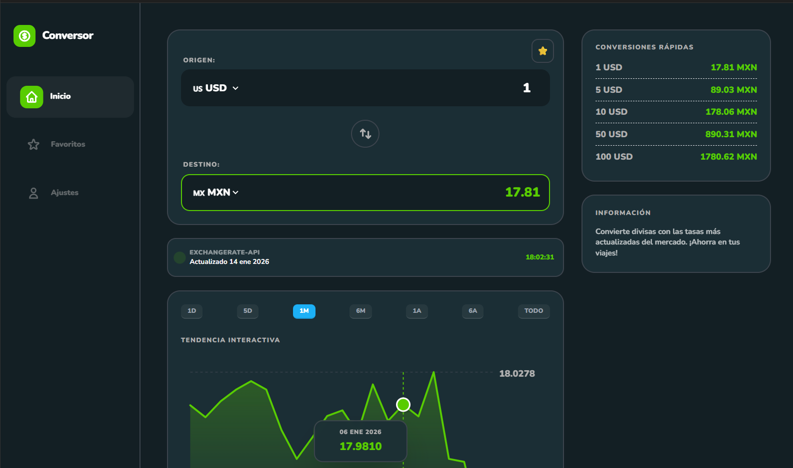
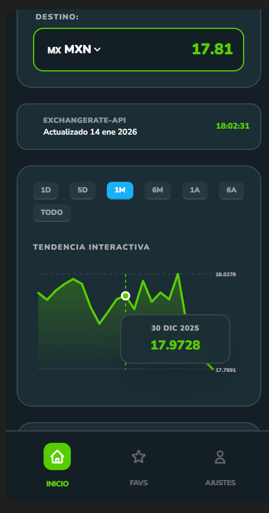
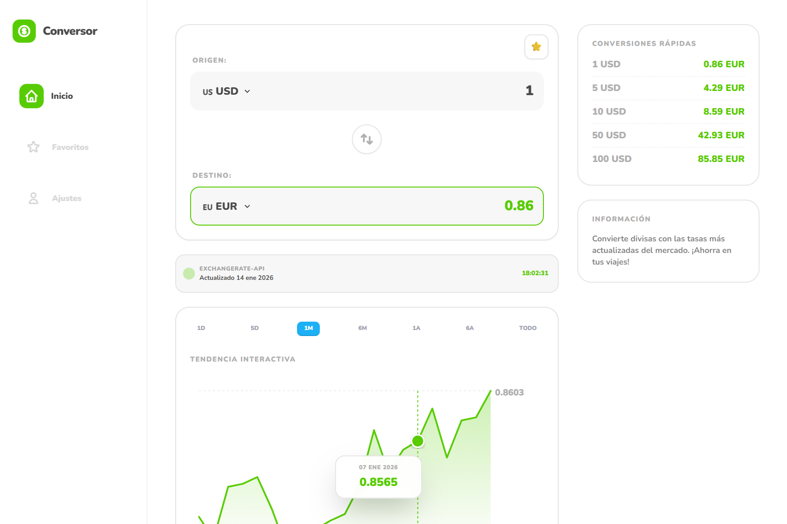
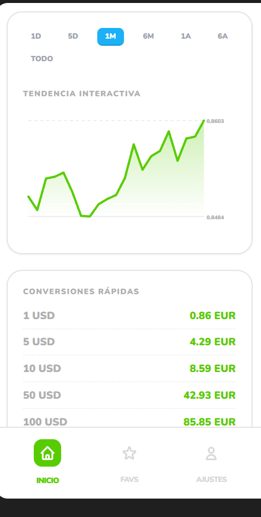
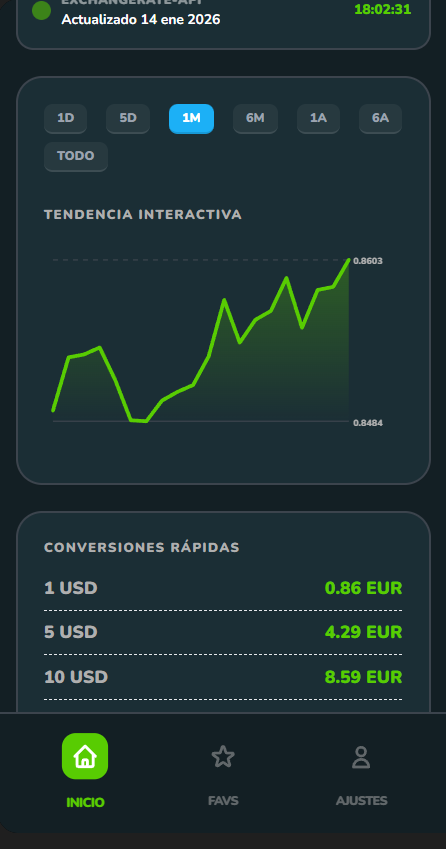
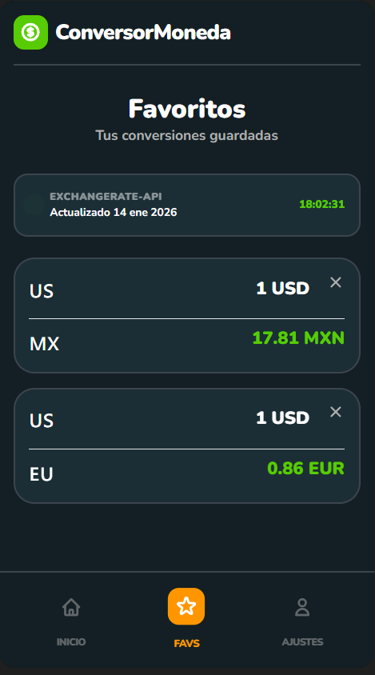
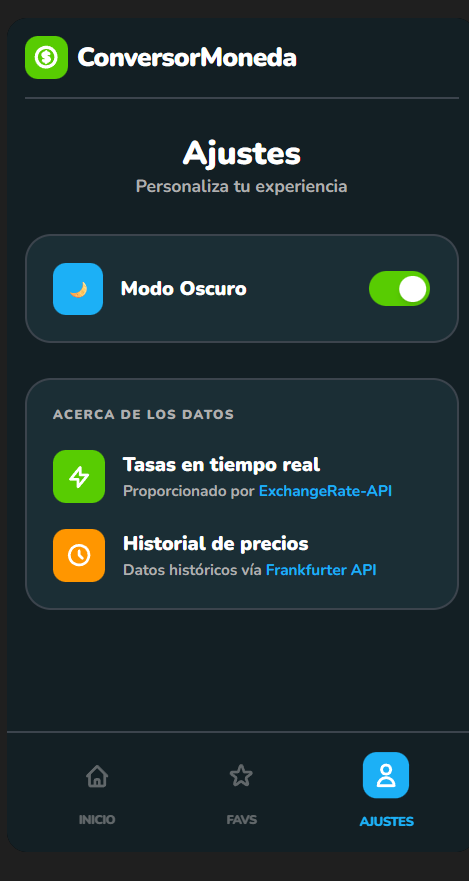

# 💱 Conversor de moneda

Aplicación web para conversión de divisas en tiempo real con historial de tasas y gráficos interactivos. Proyecto desarrollado con asistencia de IA como ejercicio de aprendizaje y exploración de tecnologías modernas.

  
  

  
  

  
  
  
  

## 🚀 Demo

🔗 **[Ver demo en vivo](https://dgs-conversor.netlify.app/)**

## ⚠️ Nota de Desarrollo

Este proyecto fue generado inicialmente con Google AI Studio (Gemini) como base de aprendizaje para explorar:
- Integración de múltiples APIs REST
- Visualización de datos con gráficos interactivos
- Implementación de temas claro/oscuro
- Diseño responsive

